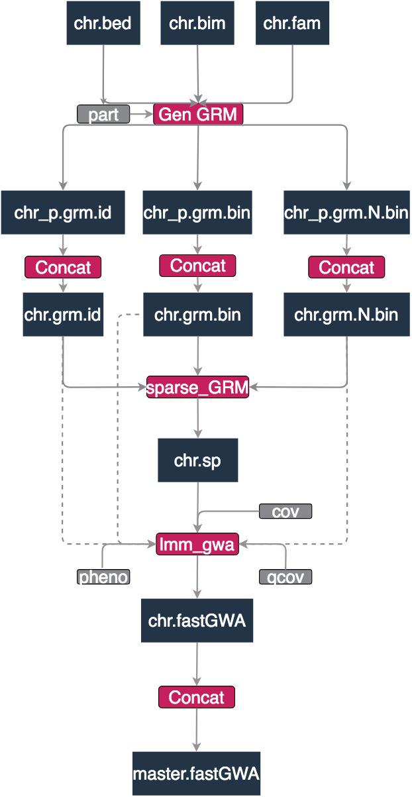
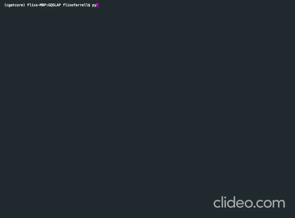

 


[](https://travis-ci.com/flixofarrell/GQSLAP) [](undefined)  [](https://www.codefactor.io/repository/github/flixofarrell/gqslap)


# GQSLAP
GWAS/QTL SimpLe Automated Pipeline

GQSLAP is an automated pipeline designed to process large plink files on HPCs. The pipeline is built ontop of CGAT-core and uses GCTA's fastGWA linear mixed model GWAS algorithm.

## Overview

GQSLAP performs the following:
   * Searches for plink files in user designated directories
   * Creates a GRM by parts to limit the amount of memory required 
   * Concatenates the GRM parts into master GRMs for each chromosome
   * Runs GCTA's lmm GWAS algorithm on the plink files and GRMs
   * Concatenates the fastGWA output into a single master summary file
   
   
Author: Felix O'Farrell
Date: June 2020





## Installation

Currently there are two ways to use GQSLAP:

1) Run the GQSLAP-build Dockerfile 

2) Clone the repo and install the dependencies      


### Docker


Create a directory called GQSLAP-build

```
mkdir GQSLAP-build
```
Create a file called Dockerfile and with
```
FROM ubuntu:bionic
RUN apt-get update && \
apt-get install -y time vim git
RUN apt-get -y install python3-pip
RUN pip3 install cgatcore 
RUN pip3 install pyyaml
RUN pip3 install ruffus
RUN pip3 install gevent
RUN pip3 install paramiko
RUN pip3 install pep8
RUN pip3 install pytest
RUN pip3 install pytest-pep8
RUN pip3 install drmaa
RUN pip3 install setuptools
RUN pip3 install six
RUN pip3 install sqlalchemy
RUN pip3 install apsw
RUN pip3 install pandas
RUN pip3 install numpy
RUN pip3 install pycoreutils
RUN pip3 install boto3
RUN pip3 install google-cloud-storage
RUN pip3 install google-cloud
RUN pip3 install ftputil
RUN pip3 install pysftp

RUN git clone https://github.com/flixofarrell/GQSLAP.git
```
Build linux GQSLAP container

```
docker build GQSLAP-build -t 'gqslap'
```
Run the container

```
docker run -it gqslap
```
move into GQSLAP dir
```
cd GQSLAP
```
run GQSLAP 
```
python3 GQSLAP.py make full --local
```

### Clone this github directory onto your system

## Dependencies 

CGAT-core is required and can be downloaded from anaconda

```bash
conda install -c bioconda cgatcore
conda install -c bioconda/label/cf201901 cgatcore
```
fastGWA is a feature in the GCTA package available [here](https://cnsgenomics.com/software/gcta/#Download)

## Usage

Go into the GQSLAP directory and open the pipeline.yml file. Alter the yml to configure with your system

```yml
general:
    author_name: Felix O'Farrell
    project_name: GQSLAP
    licence: MIT
    version: 1.0

# Pipeline specific options:

#dir of plink files
files: /path/to/your/plink/files

#title of GRM directory (made by pipeline)
GRM_dir: GRMs

#dir of GCTA64 command 
gcta_dir: path/to/gcta/gcta64

#pheno file dir
pheno: /path/to/your/pheno/file

#how many parts to split GRM into (save memory) 
#gcta authors advise 250 for UKBB scale data 
part: 3

#covariate paramters
cov : /path/to/your/cov/file
qcov: /path/to/your/qcov/file

#individuals to exclude (withdrawn consent)
rmv : /path/to/your/remove/file 
```

and run

```python
python GQSLAP.py make full 
```



## Contributing
Pull requests are welcome. For major changes, please open an issue first to discuss what you would like to change.

Please make sure to update tests as appropriate.

## License
[MIT](https://choosealicense.com/licenses/mit/)
